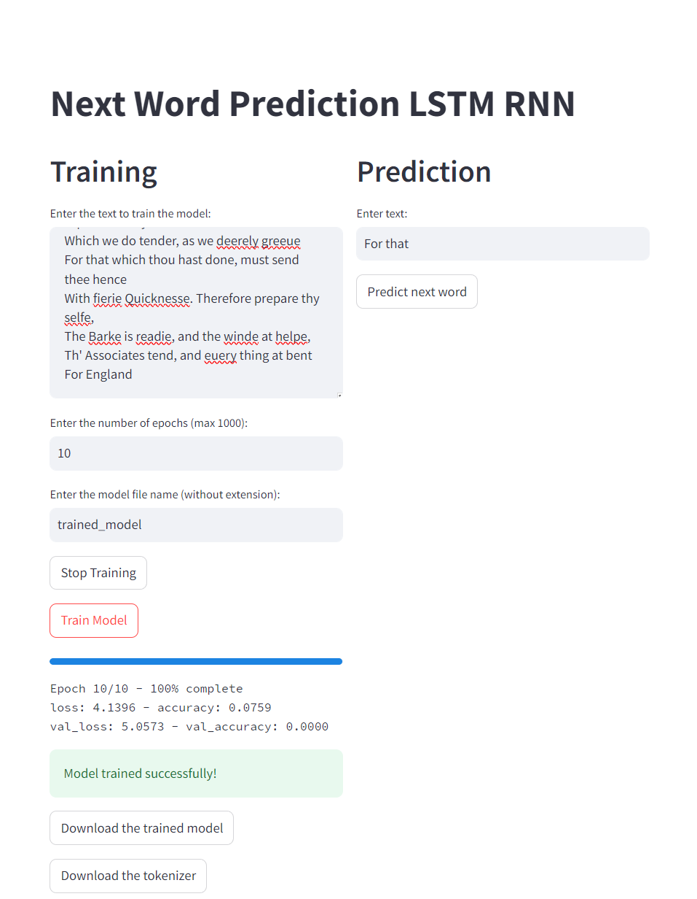

# Next Word Prediction LSTM RNN Project
This project focuses on predicting the next word in a sequence using an LSTM RNN model. The model is trained on the text of Shakespeare's "Hamlet".



## Files

- **hamlet.txt**: The dataset used for training the model.
- **next_word_prediction_model.h5**: The trained LSTM RNN model.
- **requirements.txt**: A list of required libraries to run the project.
- **tokenizer.pickle**: A pickle file containing the tokenizer used in the model.
- **train_model.py**: A script to train the model.
- **train_model.ipynb**: A Jupyter notebook to train the model interactively.
- **app.py**: A Streamlit app to predict the next word.
- **train_model_app.py**: A Streamlit app that can train the model on user-provided data and predict the next word. You can also download the trained model and tokenizer files after training.

## Setup

1. Clone the repository.
2. Install the required libraries using:
    ```bash
    pip install -r requirements.txt
    ```

## Training the Model

You can train the model using the provided script or Jupyter notebook:

- **Using the script**:
    ```bash
    python train_model.py
    ```

- **Using the Jupyter notebook**:
    Open `train_model.ipynb` in Jupyter Notebook and run the cells.

## Usage
To run the Streamlit app only for prediction, use the following command:

```bash
streamlit run app.py
```

To run the Streamlit app that can train the model alongside with prediction, use the following command:

```bash
streamlit run train_model_app.py
```

This will start a local web server, and you can interact with the app through your web browser. The app will prompt you to enter a sequence of words, and it will predict the next word using the trained model. You can also train your own model on a user-provided dataset and download the trained model and tokenizer files after training.

## License

This project is licensed under the MIT License.This project focuses on predicting the next word in a sequence using an LSTM RNN model. The model is trained on the text of Shakespeare's "Hamlet".
